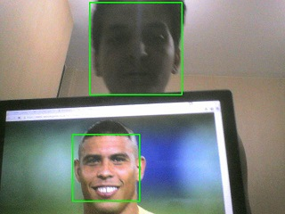

# FaceDetection python
an easy script for Face Detection in python

i will write an instruction very soon... so stay tuned in ;)

# Haar-cascade Detection in OpenCV
OpenCV comes with a trainer as well as detector. If you want to train your own classifier for any object like car, planes etc. you can use OpenCV to create one.

Here we will deal with detection. OpenCV already contains many pre-trained classifiers for face, eyes, smiles, etc. Those XML files are stored in the opencv/data/haarcascades/ folder. Let's create a face and eye detector with OpenCV.
# Examples

See examples for implementation.

### Face Detection

